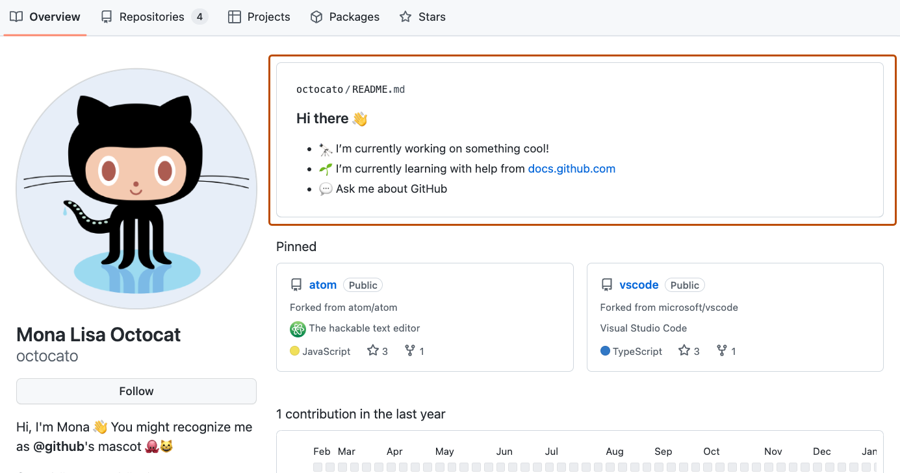
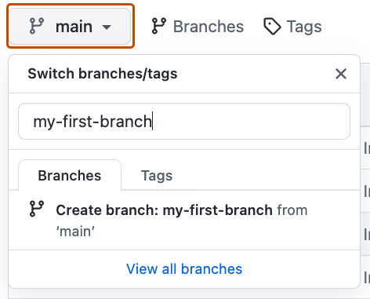
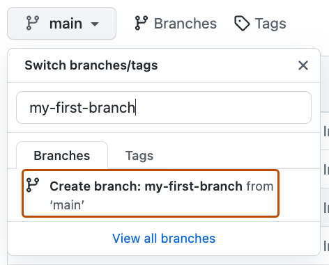

## Step 1: ブランチを作る

_「Introduction to GitHub」へようこそ！ :wave:_

**GitHub とは**: GitHub は、バージョン管理に _[Git](https://docs.github.com/get-started/quickstart/github-glossary#git)_ を使う共同作業のプラットフォームです。
[オープンソース](https://docs.github.com/get-started/quickstart/github-glossary#open-source)ソフトウェアを公開し、貢献する場として広く使われています。

:tv: [動画: What is GitHub?（英語）](https://www.youtube.com/watch?v=pBy1zgt0XPc)

**リポジトリとは**: _[リポジトリ](https://docs.github.com/get-started/quickstart/github-glossary#repository)_ は、ファイルとフォルダーを含むプロジェクトです。
リポジトリはファイルとフォルダーのバージョンを追跡します。詳しくは GitHub Docs の
「[リポジトリについて](https://docs.github.com/ja/repositories/creating-and-managing-repositories/about-repositories)」を参照してください。

**ブランチとは**: _[ブランチ](https://docs.github.com/en/get-started/quickstart/github-glossary#branch)_ は、リポジトリの並行するバージョンです。
リポジトリには最初 `main` という 1 本のブランチがあり、`main` が正式版とみなされます。
ブランチを追加すると、`main` のコピーの上で、本体に影響を与えずに安全に変更できます。
多くの人は、特定の機能に取り組むときにブランチを使い、プロジェクトの他の部分に影響を与えないようにしています。

ブランチがあるので、作業を `main` から切り離せます。
言い換えると、誰かが作業している間も全員の成果は安全に保たれます。
詳しくは「[ブランチについて](https://docs.github.com/ja/pull-requests/collaborating-with-pull-requests/proposing-changes-to-your-work-with-pull-requests/about-branches)」を参照してください。

**プロフィール README とは**: _[プロフィール README](https://docs.github.com/account-and-profile/setting-up-and-managing-your-github-profile/customizing-your-profile/managing-your-profile-readme)_ は、
GitHub のプロフィールに置く「自己紹介」で、GitHub.com のコミュニティに自分の情報を伝えられます。
GitHub はプロフィール README をプロフィールページの上部に表示します。詳しくは「[プロフィール README を管理する](https://docs.github.com/ja/account-and-profile/setting-up-and-managing-your-github-profile/customizing-your-profile/managing-your-profile-readme)」を参照してください。

### :keyboard: やること: 最初のブランチ

1. ブラウザーで新しいタブを開き、作ったばかりのリポジトリ（この演習のコピー）を開きます。説明は今のタブで読み、操作はもう一方のタブで行います。

2. リポジトリ上部のメニューで **< > Code** タブを開きます。

   

3. **main** と書かれたブランチのドロップダウンをクリックします。

   

4. **Find or create a branch...** の入力欄に `my-first-branch` と入力します。

   > **注:** 次の Step へ進む条件として、ブランチ名がチェックされます。 :wink:

5. **Create branch: `my-first-branch` from main** という文字をクリックしてブランチを作ります。

   

   - 作ったブランチに自動で切り替わります。
   - ドロップダウンの表示が新しいブランチ名になります。

6. ブランチが GitHub に作られたので、Mona が作業を確認しています。少し待って、コメントを見てください。進捗と次の Step が投稿されます。

うまくいかないとき 🤷
 

コメントが付かないときは、次を確認してください。
- ブランチ名が正確に `my-first-branch` になっているか（前後に余計な文字を付けない）。

