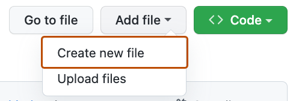
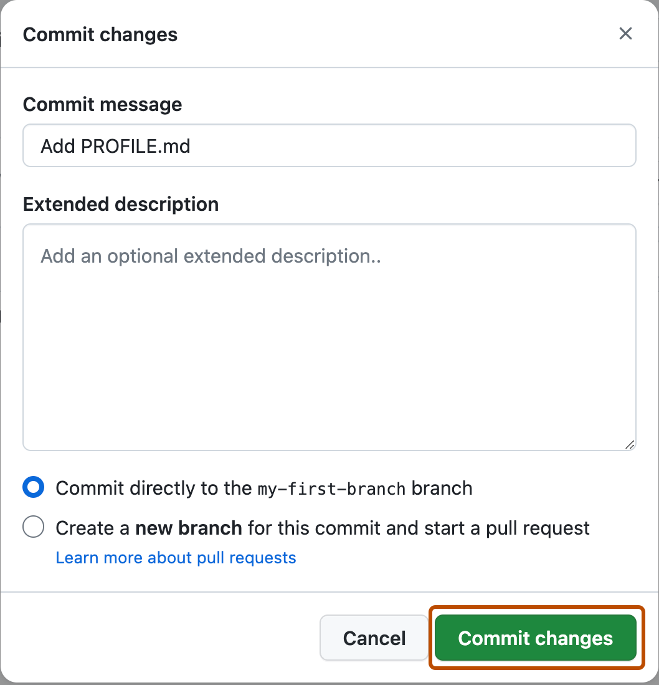

## Step 2: ファイルをコミットする

_ブランチができました！ :tada:_

ブランチを作ると、`main` を変えずにプロジェクトを編集できます。ブランチができたので、次はファイルを作って最初のコミットをしましょう。

**コミットとは**: _[コミット](https://docs.github.com/pull-requests/committing-changes-to-your-project/creating-and-editing-commits/about-commits)_ は、プロジェクト内のファイルやフォルダーに対する変更のひとまとまりです。コミットはブランチの中に存在します。詳しくは「[コミットについて](https://docs.github.com/ja/pull-requests/committing-changes-to-your-project/creating-and-editing-commits/about-commits)」を参照してください。

### :keyboard: やること: 最初のコミット

次の手順で、GitHub 上で変更をコミットします。コミットは、ファイルの追加・削除・名前変更や、ファイル内容の変更を記録します。この演習では、新しいブランチに新しいファイルを追加することがコミットになります。

> [!NOTE]
> `.md` は Markdown ファイルの拡張子です。Markdown については GitHub Docs の「[基本的な書き方と書式設定の構文](https://docs.github.com/ja/get-started/writing-on-github/getting-started-with-writing-and-formatting-on-github/basic-writing-and-formatting-syntax)」か、Skills 演習「[Communicating using Markdown](https://github.com/skills/communicate-using-markdown)」で学べます。

1. リポジトリ上部の **< > Code** タブで、ブランチが `my-first-branch` になっていることを確認します。

2. **Add file** ドロップダウンを開き、**Create new file** をクリックします。

   

3. **Name your file...** 欄に `PROFILE.md` と入力します。

4. **Enter file contents here** の領域に、次の内容を貼り付けます。

   ```
   Welcome to my GitHub profile!
   ```

   

5. 内容欄の右上にある **Commit changes...** をクリックします。ダイアログが開きます。

6. GitHub がコミットメッセージを提案しますが、練習として自分で入力します。**Commit message** 欄に `Add PROFILE.md` と入力します。

   - **コミットメッセージ**と任意の**拡張説明**は、変更の意図を伝えるためのものです。複数のファイルを変えたときに特に役立ちます。

   

7. 他の欄は今は無視して、**Commit changes** をクリックします。

8. ファイルを変更したので、Mona が作業を確認しています。少し待って、コメントを見てください。進捗と次の Step が投稿されます。


<details>
<summary>うまくいかないとき 🤷</summary><br/>

コメントが付かないときは、次を確認してください。
- ブランチが `my-first-branch` になっているか。
- `PROFILE.md` がリポジトリの直下（ルート）に作られているか。

</details>
