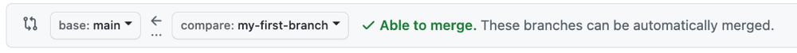

## Step 3: pull request を開く

_コミットできました！ :sparkles:_

プロジェクトに変更を加えてコミットしたので、次は pull request で変更の提案を共有します。

**pull request とは**: 共同作業は _[pull request](https://docs.github.com/en/get-started/quickstart/github-glossary#pull-request)_ の上で行われます。pull request は、ブランチの変更を他の人に見せ、受け入れる・却下する・追加の変更を提案する、ができるようにします。今回の pull request は、ブランチで行った変更を `main` に適用する提案です。詳しくは「[pull request について](https://docs.github.com/ja/pull-requests/collaborating-with-pull-requests/proposing-changes-to-your-work-with-pull-requests/about-pull-requests)」を参照してください。

### :keyboard: やること: pull request を作る

コミットの後、「ブランチに push がありました」というメッセージと **Compare & pull request** ボタンが表示されているかもしれません。

**Compare & pull request** を押せば自動で作成画面に進めます。押した場合は下の 5 へ進んでください。練習のため、1〜4 の手動手順で作ることもできます。

1. リポジトリ上部のメニューで **Pull requests** タブをクリックします。
2. **New pull request** ボタンをクリックします。
3. ドロップダウンで次のブランチを選びます。

   - **base:** `main`
   - **compare:** `my-first-branch`

   

4. **Create pull request** をクリックします。

5. pull request のタイトルを入力します。既定ではコミットメッセージが入っています。練習として `Add my first file` に書き換えます。

6. 次の欄は変更の**説明**です。ここまでにやったことを短く書きます。やったことは、新しいブランチを作った、ファイルを作った、コミットした、の 3 つです。

   

7. **Create pull request** をクリックします。

8. 共同作業の場ができたので、Mona が作業を確認しています。少し待って、コメントを見てください。進捗と次の Step が投稿されます。

うまくいかないとき 🤷
 

コメントが付かないときは、次を確認してください。
- pull request のタイトルが `Add my first file` になっているか。
- 説明欄が空でないか。

